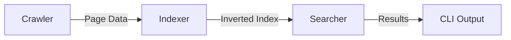

# COMP3011 Search Engine Tool — Web Services & Data

A professional, high-performance command-line search engine built for the University of Leeds COMP3011 Coursework. The tool systematically crawls **quotes.toscrape.com**, processes the content into a persistent inverted index, and provides a ranked search interface using the TF-IDF (Term Frequency-Inverse Document Frequency) algorithm.

---

## 🔍 Key Features

*   **Intelligent Crawler:** Scoped strictly to the target domain with 100% deduplication of URLs.
*   **Polite Scraper:** Enforces a mandatory ≥6-second inter-request delay to respect server resources.
*   **Rich Pre-processing:** Tokenisation, stop-word removal, and Porter Stemming (via NLTK) for high-recall search.
*   **Ranked Retrieval:** Advanced TF-IDF scoring with document length normalisation for fair ranking.
*   **Persistence:** Full JSON-based index serialisation and reloading capabilities.
*   **Context Snippets:** Dynamic snippet generation to show matching context in search results.
*   **100% Test Coverage:** Robust test suite covering every branch, edge case, and CLI command.

---

## 🛠️ Installation

```bash
# Clone the repository and install dependencies
pip install -r requirements.txt
```

---

## 🚀 Usage Guide

The system uses a unified CLI with four primary subcommands: `build`, `load`, `print`, and `find`.

### 1. Build the Index (Crawl + Index + Save)
The `build` command traverses the target site, extracts data, and saves it to a persistent JSON file.
```bash
python main.py build
```

### 2. Search & Rank
The `find` command ranks all indexed pages against your query and shows the top matches with live context snippets.
```bash
python main.py find "science life"
```

### 3. Print All Indexed Pages
Lists every document currently stored in the index for debugging or verification.
```bash
python main.py print
```

### 4. Load & Verify
Confirms that a saved index file can be successfully reloaded into memory.
```bash
python main.py load
```

---

## 🏗️ System Architecture

The search engine follows a decoupled, three-stage pipeline:



### 1. Crawler (`search_engine/crawler.py`)
Fetches HTML using `requests` and parses content with `BeautifulSoup`. It maintains a visited-set to prevent infinite loops and handles URL normalisation (stripping fragments and trailing slashes).

### 2. Indexer (`search_engine/indexer.py`)
Builds a mapping from unique tokens to the documents where they appear. It applies a linguistic cleaning process:
`Lowercasing` → `Word Tokenisation` → `Stop Word Removal` → `Porter Stemming`.

### 3. Searcher (`search_engine/searcher.py`)
Scores documents using the **TF-IDF** formula. It balances term frequency in a document against how common the term is across the whole collection, ensuring that rare, informative words carry more weight in the ranking.

---

## 🧪 Testing & Quality Assurance

The project maintains **100% total code coverage**. Tests use mocked HTTP sessions to ensure they are fast, reliable, and do not require an active internet connection.

### Run all tests with coverage report:
```bash
# Automated by pytest.ini and .coveragerc
pytest
```

---

## 📝 Project Details

*   **Module:** COMP3011 — Web Services and Web Data
*   **Target Site:** https://quotes.toscrape.com
*   **Technical Stack:** Python 3, NLTK, BeautifulSoup4, Requests, Pytest

---

## 📖 AI Declaration
This project was developed with the integral assistance of **Claude 3.5 Sonnet**, following the University of Leeds **"Green"** traffic light guidelines. A full reflection and log of all AI interactions can be found in `GENAI_REFLECTION.md`.
